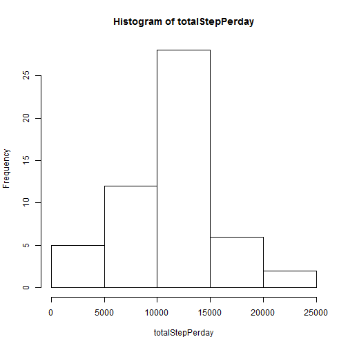
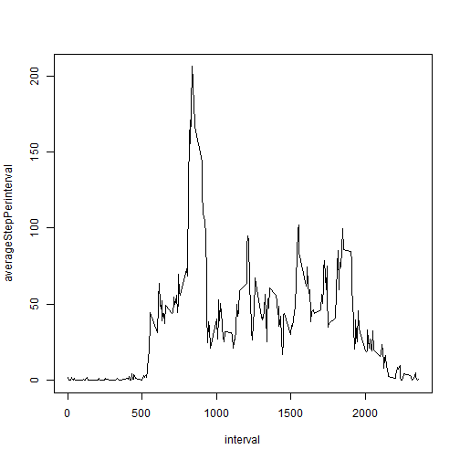
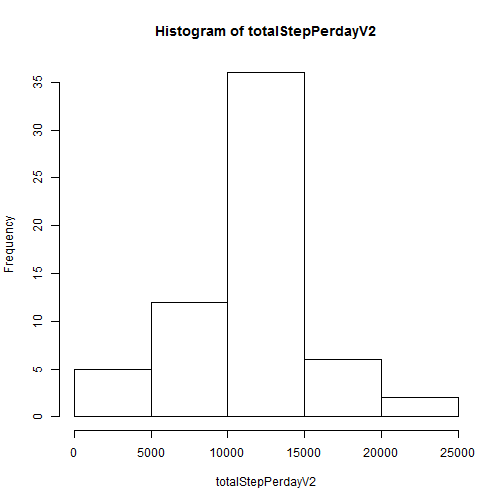
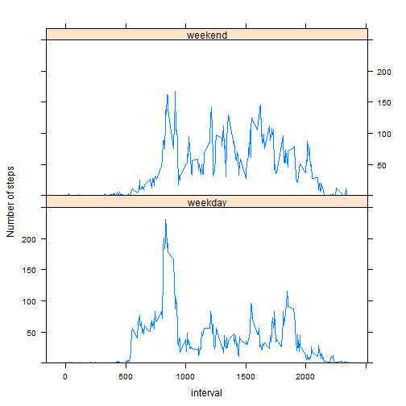

## Loading and preprocessing the data
1. Load the data using read.csv

```r
data <- read.csv('activity.csv', colClasses = c('integer', 'character', 'integer'))
```

2. Transform the date variable into Date format to suit the further analysis

```r
data$date <- as.Date(data$date)
```

## What is mean total number of steps taken per day?
1. Make a histogram of the total number of steps taken each day, using tapply to do the summation for each day.

```r
totalStepPerday <- tapply(data$steps, data$date, sum)
hist(totalStepPerday)
```

 

2.Calculate and report the **mean** and **median** total number of steps taken per day

```r
mean(totalStepPerday, na.rm=TRUE)
```

```
## [1] 10766
```

```r
median(totalStepPerday, na.rm=TRUE)
```

```
## [1] 10765
```

## What is the average daily activity pattern?
1. Make a time series plot (i.e. type = "l") of the 5-minute interval (x-axis) and the average number of steps taken, averaged across all days (y-axis)

```r
averageStepPerinterval <- tapply(data$steps, as.factor(data$interval), function(x) mean(x, na.rm=TRUE))
plot(data$interval[1:length(averageStepPerinterval)], averageStepPerinterval, type='l', xlab='interval')
```

 

2. Which 5-minute interval, on average across all the days in the dataset, contains the maximum number of steps?

```r
names(which.max(averageStepPerinterval))
```

```
## [1] "835"
```

## Imputing missing values
1. Calculate and report the total number of missing values in the dataset (i.e. the total number of rows with NAs)

```r
sum(is.na(data$steps))
```

```
## [1] 2304
```

2. I choose the strategy of using the mean for that 5-minute interval (averaged across all days) to fill the missing values in the data set

3. Create a new dataset (data2) that is equal to the original dataset but with the missing data filled in.

```r
data2 <- data.frame(data)
data2$steps[is.na(data2$steps)] <- rep(averageStepPerinterval, length(totalStepPerday))[is.na(data2$steps)]
```

4. Make a histogram of the total number of steps taken each day and Calculate and report the mean and median total number of steps taken per day. Do these values differ from the estimates from the first part of the assignment? What is the impact of imputing missing data on the estimates of the total daily number of steps?

```r
totalStepPerdayV2 <- tapply(data2$steps, data2$date, sum)
hist(totalStepPerdayV2)
```

 

```r
mean(totalStepPerdayV2)
```

```
## [1] 10766
```

```r
median(totalStepPerdayV2)
```

```
## [1] 10766
```

The mean value does not change, but the median is different than before. Imputing missing data may change some statistical result.

## Are there differences in activity patterns between weekdays and weekends?
1. Create a new factor variable in the dataset with two levels - "weekday" and "weekend" indicating whether a given date is a weekday or weekend day.

```r
data2$dateType <- 'weekday'
data2$dateType[weekdays(data2$date) %in% c('Saturday', 'Sunday')] <- 'weekend'
data2$dateType <- as.factor(data2$dateType)
```

2. Make a panel plot containing a time series plot (i.e. type = "l") of the 5-minute interval (x-axis) and the average number of steps taken, averaged across all weekday days or weekend days (y-axis).

```r
library(lattice)
xyplot(steps ~ interval | dateType, data=data2,
       layout=c(1, 2), type='l', ylim=c(0, 250), ylab='Number of steps',
       panel = function(x, y, ...){
         ty <- tapply(y, as.factor(x), mean)
         tx <- x[1:length(levels(as.factor(x)))]
         panel.xyplot(tx, ty, ...)
       })
```

 

